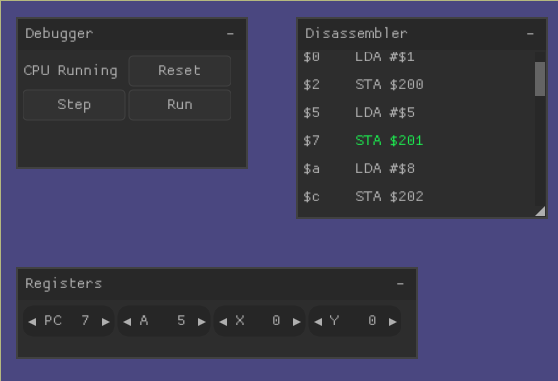

# 6502 Toolchain

[](colors.webm)

This project aims to create a portable toolchain for developing,
testing and debugging programs for the 6502 processor. An assembler
may be implemented in the future but no work has been done on that
yet.

The `instructions.h` header is generated from `6502.csv` and contains
definitions of every 6502 opcode, its mnemonic and addressing mode.
It is built automatically by cmake. 


```
 ____________________________________
/ On the subject of C program        \
| indentation: "In My Egotistical    |
| Opinion, most people's C programs  |
| should be indented                 |
| six feet downward and covered with |
| dirt."                             |
|                                    |
\ -- Blair P. Houghton               /
 ------------------------------------
        \   ^__^
         \  (oo)\_______
            (__)\       )\/\
                ||----w |
                ||     ||
```
